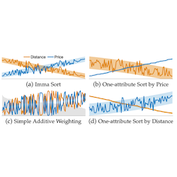

This folder contains Matlab codes of the Hastie-Stuetzle principal curve algorithm, generating synthetic data sets, and simulations described in Section 5.3.

PCA_BC_Ranking_Final.m is the main file of Hastie-Stuetzle principal curve algorithm, which depends on the following Matlab functions:

- PCA_BC_Ranking_Weighted_MultiAtrri.m
- NearestPointOnBCurveDiscreteMethodWeighted.m
- cvxForIntermediateControlPointsWeightedMultiAttri.m.

randomMoreThan2AttributeValues.m and random2dAttributeValues.m are two functions that randomly generate synthetic datasets for main simulations.

1. Run Simulation_vs_CorrelationAndWeights.m to start the simulation v.s. correlations and weights (Fig. 6)
2. Run Simulation_vs_ListLength.m to start the simulation v.s. list length (Fig. 7). 
3. Run Simulation_vs_AttributeNum.m to start the simulation v.s. attribute numbers (Fig. 8). 

Each of the above three simulation files generates I’mma Sort results as well as the performance measurement, i.e., prediction interval, in .mat format.

rankPredictionInterval.m calculates our main performance metric prediction interval for the generated sorting results.

# Requirements
These Matlab codes can be run in following environment:
- Matlab 2016a or higher version (https://www.mathworks.com/products/matlab.html), 
- cvx (http://cvxr.com/cvx/) 
-	MOSEK (https://www.mosek.com/).

The details of installing cvx and mosek in Matlab are in http://cvxr.com/cvx/doc/mosek.html

@article{lyuimma,
  title={Imma Sort by two or more attributes with Interpretable Monotonic Multi-Attribute Sorting},
  author={Lyu, Yan and Gao, Fan and Wu, I-Shuen and Lim, Brian Y},
  journal={IEEE transactions on visualization and computer graphics}
}
